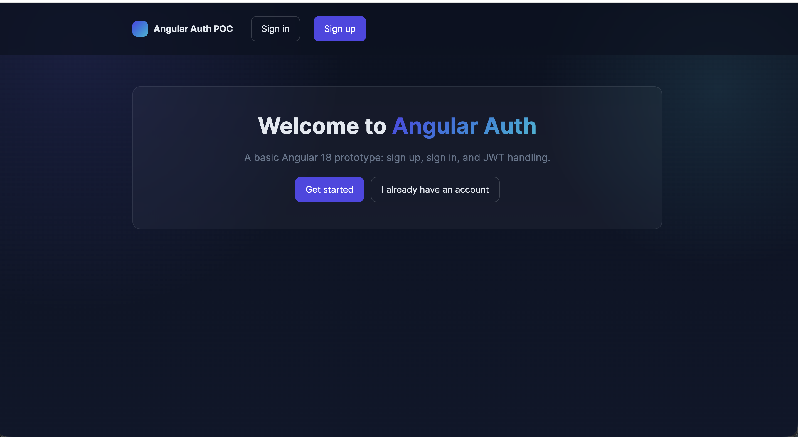
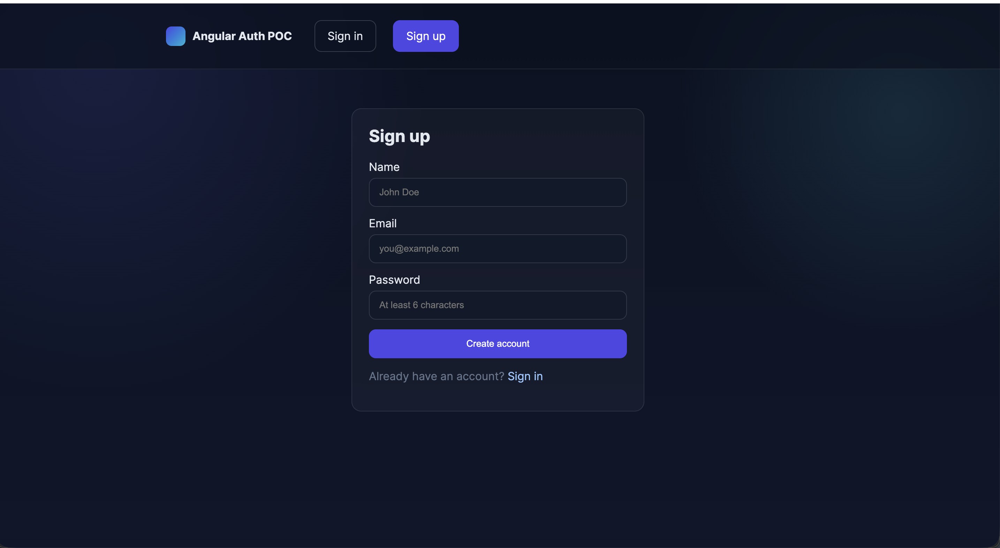
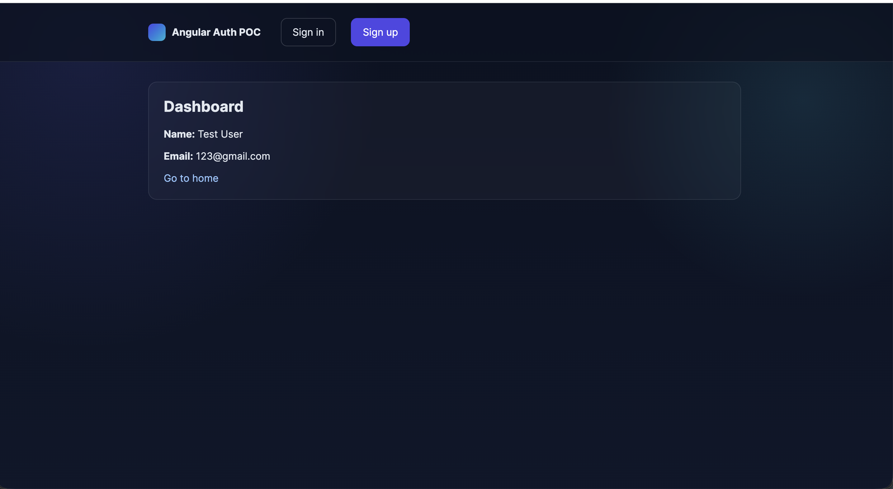

# Angular 18 Auth Prototype

A basic prototype on Angular 18 with:

- Landing page with a nice background and CTA buttons
- Sign up and sign in (Reactive Forms, validation)
- JWT handling via Http Interceptor
- Protected route `/dashboard` via guard
- Fake backend implemented as an Http Interceptor (data stored in `localStorage`)

## Stack
- Angular 18 (standalone components)
- Router, HttpClient, Signals
- SCSS styles

## Run locally
1. Install Node.js 18+.
2. Install dependencies and start the dev server:

```bash
cd webapp
npm ci
npm start
```

The app will be available at http://localhost:4200

## Structure
- `src/app/features/landing` — landing page
- `src/app/features/auth` — sign-in and sign-up forms
- `src/app/features/dashboard` — protected page
- `src/app/core/auth` — auth service, guard, interceptors

## Security notes
This project uses a learning-oriented fake backend and an unsigned pseudo-JWT. Don’t use this in production. In a real app you should:
- Sign and verify JWTs on the server
- Store tokens securely (HttpOnly cookies are preferable)
- Implement refresh tokens and global 401 handling

## Testing
- Run unit tests in headless mode and generate coverage report:

```bash
npm test
```

- Watch mode (runs tests on file changes):

```bash
npx ng test
```

## Screenshots




